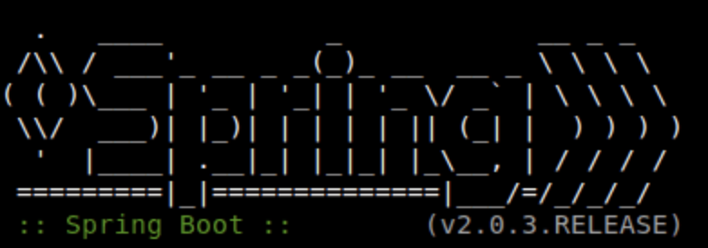

### Welcome 🙏 to `print big`
This package was inspired by the Spring Boot startup logs when you lunch an app. 



### Installation
You can install printbig directly from your python package manager using the following line in the terminale: 

`pip install printbig` 

### Usage
For now the package has one function called printbig that that takes one argument. 

**NOTE**: It does not support any special characters only the english alphabet. 

Let's see an example:
```
from printbig import printbig
printbig("ciao")
```

```
CCCCC  IIIII    A    OOOOO  
C        I     A A   O   O  
C        I    AAAAA  O   O  
C        I    A   A  O   O  
CCCCC  IIIII  A   A  OOOOO
```
More examples:

```
from printbig import printbig
printbig("tensorflow")
```

```
TTTTT  EEEEE  N   N  SSSSS  OOOOO  RRRRR  FFFFF  L      OOOOO  W   W 
  T    E      NN  N  S      O   O  R   R  F      L      O   O  W   W 
  T    EEEEE  N N N  SSSSS  O   O  RRRRR  FFFFF  L      O   O  W W W 
  T    E      N  NN      S  O   O  R R    F      L      O   O  W W W 
  T    EEEEE  N   N  SSSSS  OOOOO  R   R  F      LLLLL  OOOOO  WW WW 
```

Even More:

```
from printbig import printbig
printbig("spring boot")
```

```
SSSSS  PPPPP  RRRRR  IIIII  N   N  GGGGG  	BBBBB  OOOOO  OOOOO  TTTTT  
S      P   P  R   R    I    NN  N  G      	B   B  O   O  O   O    T    
SSSSS  PPPPP  RRRRR    I    N N N  G  GG  	BBBBB  O   O  O   O    T    
    S  P      R R      I    N  NN  G   G  	B   B  O   O  O   O    T    
SSSSS  P      R   R  IIIII  N   N  GGGGG  	BBBBB  OOOOO  OOOOO    T 
```
   

